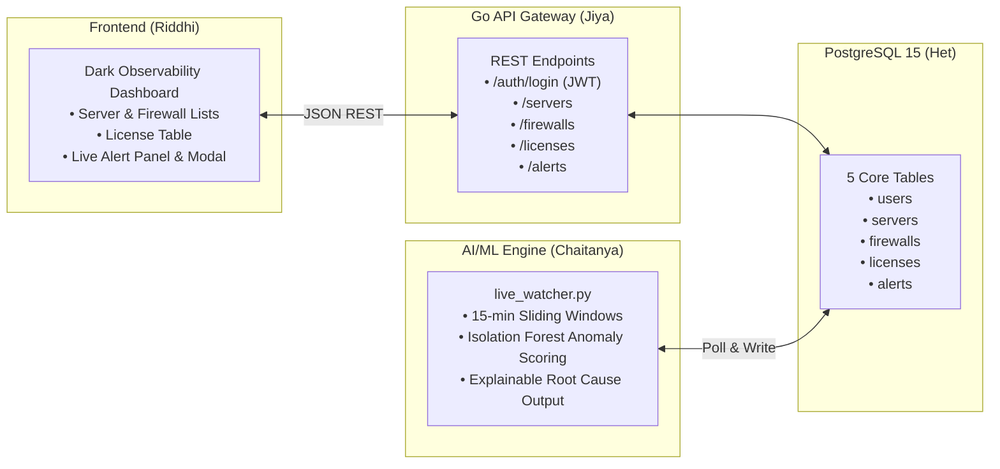

# 🛡️ Cyber Lakshya (CHA-39) — Complete Project Strategy & Execution Guide

**Smart India Hackathon 2026**  
* **Problem Statement ID**: `CHA-39`  
* **Title**: Cybersecurity Portal for Effective Management of Servers and Firewalls (DCIM)  
* **Organization**: All India Council for Technical Education (AICTE)  
* **Team**: Cyber Lakshya (`DEPSTAR-SIH-880700`)  
* **Solution Name**: SecurEdge  

---

## 📌 1. Executive Summary & Core Objective

The All India Council for Technical Education (AICTE) manages thousands of servers, firewalls, and software licenses distributed across educational institutions nationwide. Current operations suffer from:
1. **Fragmented Tooling:** Disconnected systems for hardware assets, firewalls, and identity.
2. **Manual Overhead:** High latency in provisioning, patching, and policy rollouts.
3. **Limited Behavioral Visibility:** Traditional monitoring only detects static threshold breaches rather than identity and infrastructure abuse.
4. **License & Access Sprawl:** Lack of central RBAC and license lifecycle tracking.

**SecurEdge** solves this by delivering a unified, on-premise, Zero-Trust Data Center Infrastructure Management (DCIM) and cybersecurity portal.

---

## ⚔️ 2. Competitive Landscape & The "Market Gap"

### The Fragmented Reality of Existing Solutions

| Tool Category | Popular Solutions | Capabilities Provided | Critical Gaps for AICTE CHA-39 |
| :--- | :--- | :--- | :--- |
| **DCIM & Rack Management** | NetBox, openDCIM | IPAM, physical rack layouts, device cables, hardware specs. | ❌ No live telemetry, no firewall rule push, no user RBAC, no AI anomaly detection. |
| **Identity & Access Management (IAM)** | Keycloak, Authentik, Authelia | User login, OAuth2/OIDC, SSO, basic group permissions. | ❌ Completely blind to hardware inventory, firewall rules, and infrastructure state. |
| **Security Information & Event (SIEM)** | Wazuh, OSSIM, Splunk | Log collection, signature-based IDS alerts, rootkit detection. | ❌ No rack visualization, no license lifecycle, rigid regex rules, high noise. |
| **Firewall Management** | pfSense, OPNsense, Panorama | Packet filtering, NAT, routing policies. | ❌ Manages only one node or proprietary brand; no multi-vendor university orchestrator. |
| **Commercial Cloud SASE / AIOps** | Cloudflare One, New Relic, Datadog | Edge Zero-Trust access, APM monitoring, cloud anomaly alerts. | ❌ **Huge per-seat SaaS costs** across 1,000+ colleges; **routes data via foreign cloud CDNs** (violating MeitY data sovereignty mandates). |

### 🎯 The Cyber Lakshya Value Proposition (Why SecurEdge Wins)
* **Single Pane of Glass Triad:** One database, one login, and one portal uniting Physical Racks + User Identity + Network Firewalls + Live Telemetry.
* **Explainable Anomaly AI (XAI):** Unsupervised `IsolationForest` correlating identity behavior and API actions with human-readable root causes.
* **Sovereign & Zero-Cost:** 100% on-premises, MeitY compliant, zero recurring SaaS bills.

---

## 🎯 3. Laser-Focused Hackathon Scope (The Core Prototype)

To avoid feature creep and ensure a rock-solid live demo, the team builds a lean, cohesive core:



### Team Deliverables Matrix

| Team Member | Role | Core Hackathon Deliverable (Code) | Pitch / Vision Deliverable (Slides) |
| :--- | :--- | :--- | :--- |
| **Het Pansara** | Database Lead | PostgreSQL schema (`users`, `servers`, `firewalls`, `licenses`, `alerts`, `audit_logs`) + seed data. | Partitioning strategy & blockchain audit hash anchoring. |
| **Jiya Bhayani** | Backend Developer | Go API server with Casbin/JWT route protection and CRUD endpoints. | High-throughput Goroutine concurrency benchmarks. |
| **Chaitanya Thakar** | AI/ML Lead & RBAC | `live_watcher.py` (Isolation Forest anomaly pipeline + explainability engine) + Casbin RBAC policies. | NSL-KDD benchmark validation metrics & ROC-AUC curves. |
| **Riddhi Odedra** | UI/UX Developer | Dark-mode React dashboard + Anomaly Inspector Modal + network list. | 2D/3D Thermal CFD Digital Twin & live rule impact simulator. |
| **Maharshi Trivedi** | Lead Architect | System security architecture, JWT secret governance, end-to-end flow. | eBPF kernel sandboxing architecture. |
| **Siddharthsinh Raulji**| Researcher | NIST SP 800-53, CIS Controls & MeitY compliance mapping. | Presentation pitch narration & viva defense support. |

---

## 🧠 4. Deep-Dive: Chaitanya's AI/ML & RBAC Deliverables

### A. RBAC Matrix & Token Enforcement
Standard 4-tier hierarchy enforced via Casbin and signed JWTs (RFC 7519):

```
Role         Servers      Firewall Rules    Licenses      User Mgmt     Audit Logs
viewer       read         read              —             —             —
operator     read/write   read              read          —             —
admin        read/write   read/write        read/write    read          read
super-admin  read/write   read/write        read/write    read/write    read
```

### B. The 15-Minute Sliding Window Anomaly Pipeline
* **Feature Set:**
  1. `login_count_15m`: Total login attempts in the window.
  2. `failed_login_count_15m`: Failed login count (flags brute-force).
  3. `distinct_endpoints_15m`: Unique API endpoints queried (flags scanning/privilege enumeration).
  4. `distinct_ips_15m`: Unique source IP addresses (flags session hijacking).
  5. `hour_sin` & `hour_cos`: Cyclical hour-of-day encoding (flags off-hours activity).
* **Model:** Unsupervised `sklearn.ensemble.IsolationForest(n_estimators=100, contamination=0.05)`.
* **Explainability (XAI):** Calculates feature z-score divergence against the training baseline to generate human-readable explanations (e.g., *"Flagged: 7 failed logins and 3 distinct IPs during off-hours"*).

---

## 🎓 5. Hackathon Judge Defense Cheat-Sheet

| Judge Question | The Winning Technical Answer |
| :--- | :--- |
| **"Why not use LSTM or Deep Autoencoders?"** | *"Isolation Forest is an unsupervised tree-based algorithm with $O(n \log n)$ training complexity and sub-millisecond inference latency. In a real-time DCIM gateway processing thousands of events per second, it provides instant explainability without requiring millions of labeled attack records or costly GPU clusters."* |
| **"How do you prevent Model Poisoning?"** | *"We avoid blind online retraining on live incoming traffic. The model trains on a frozen, verified clean baseline. Production updates occur through scheduled offline retraining on audited, human-verified logs."* |
| **"How does this implement Zero Trust?"** | *"Traditional security only authenticates at the perimeter during login. SecurEdge implements Continuous Behavioral Verification—evaluating ongoing user actions against normal behavioral baselines to flag or revoke compromised sessions dynamically."* |
| **"Why not just deploy NetBox or Wazuh?"** | *"NetBox manages physical assets with no firewall sync or live behavioral AI; Wazuh captures logs with no DCIM topology or license management. Combining them requires maintaining 5 separate databases and tools. SecurEdge unifies these into one sovereign, Zero-Trust portal."* |

---

## ⏱️ 6. 2-Day Execution Roadmap

```
Day 1: Core Build & Schema Lock
├── 00:00–00:30 | Align schema contracts (Het, Jiya, Riddhi, Maharshi)
├── 00:30–02:30 | Adapt anomaly pipeline & train baseline Isolation Forest model
├── 02:30–04:00 | Build & test live_watcher.py with DB polling
├── 04:00–05:00 | Set up Casbin rbac_model.conf + policy.csv
└── 05:00–07:00 | Smoke-test end-to-end data flow

Day 2: Integration, Polish & Rehearsal
├── 00:00–02:00 | Full team integration test (Go API ↔ PostgreSQL ↔ Python Watcher ↔ UI)
├── 02:00–03:00 | Fix integration edge cases & schema mismatches
├── 03:00–04:30 | Run NSL-KDD benchmark script for Slide 6 ROC curves
└── 04:30–07:00 | Team dry-run & judge viva rehearsal
```
