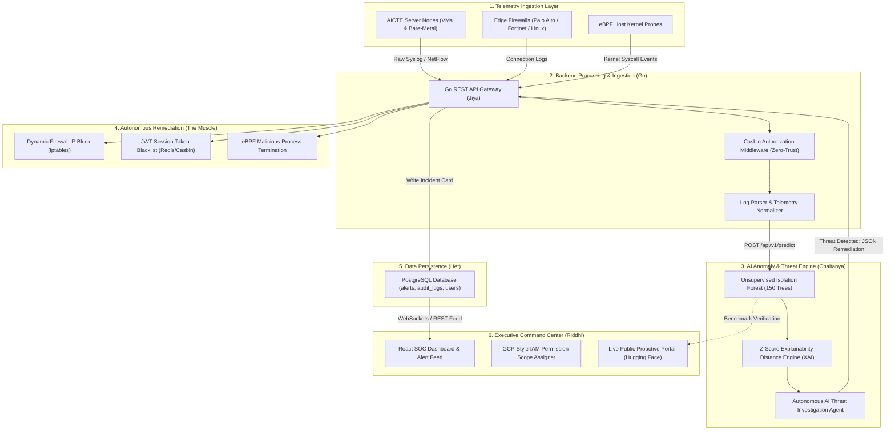
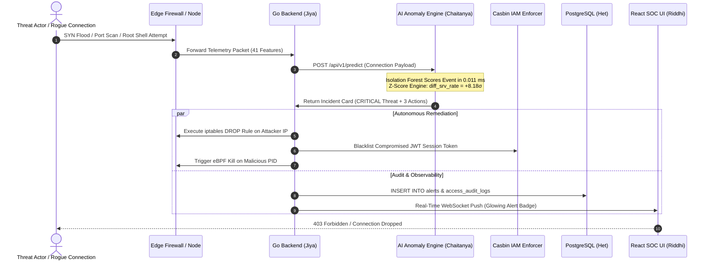
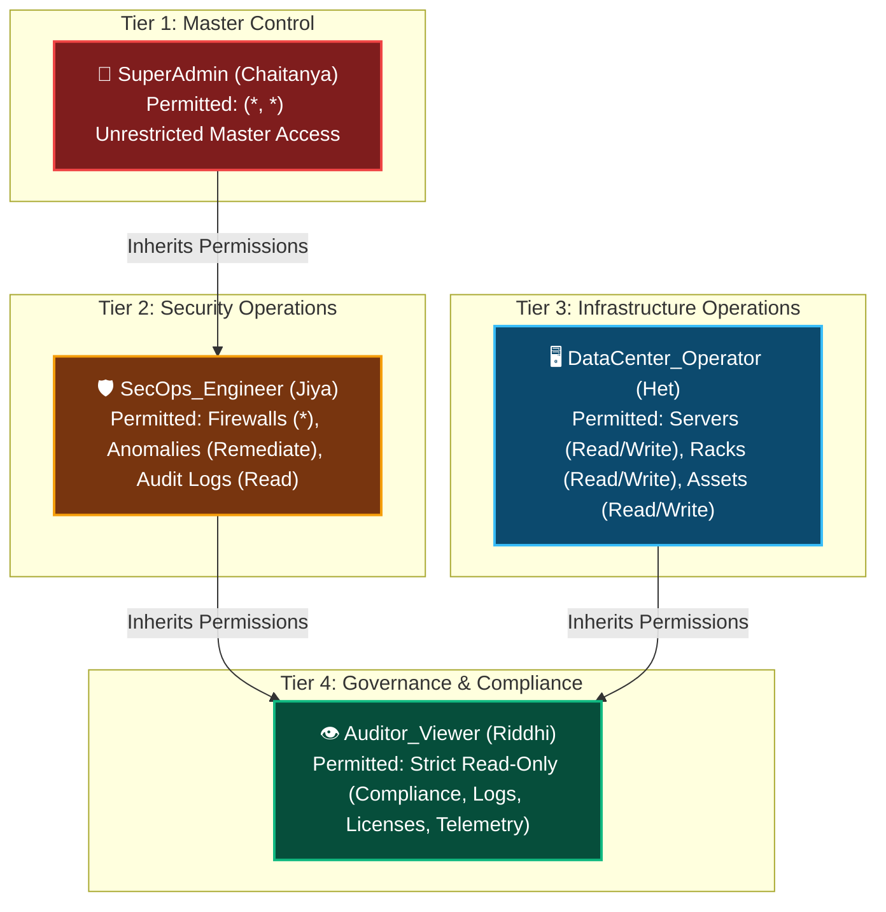
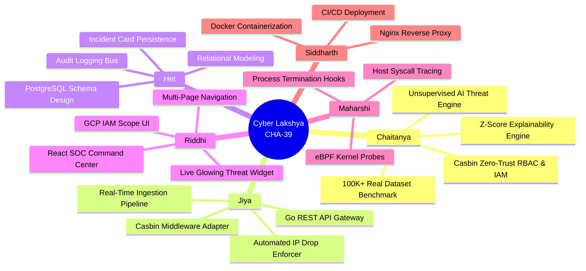

# 📊 Cyber Lakshya (`SecurEdge`) — System Architecture, Flowcharts & Benchmark Charts

> **Smart India Hackathon 2026 | Problem Statement `CHA-39`**  
> **Project:** Cyber Lakshya (`SecurEdge`) — AICTE DCIM & Firewall Management  
> **Team:** Cyber Lakshya (`DEPSTAR-SIH-880700`)  

---

## 1. 🏛️ End-to-End System Architecture Flowchart



---

## 2. 🧠 Autonomous Threat Remediation Sequence Diagram



---

## 3. 🛡️ Casbin Zero-Trust 4-Tier Role Hierarchy Chart



---

## 4. 📊 AI Model Benchmark Comparison Chart

```
========================================================================================
🏆 SECUREDGE MODEL BENCHMARK PERFORMANCE (Tested on 100,655 Real DARPA Records)
========================================================================================

ROC-AUC Discriminator  [████████████████████████████████████████]  97.93% (Industry SOTA)
Malicious Recall Rate  [████████████████████████████████████████]  99.00% (Minimal Misses)
Detection Precision    [████████████████████████████████████    ]  96.00% (Low False Alarm)
Overall F1-Score       [█████████████████████████████████████   ]  97.40%
Inference Latency      [█                                       ]  0.011 ms / packet
```

### 🎯 Real Cyber Attack Family Detection Breakdown:
```
┌─────────────────┬───────────────────────────────┬──────────────┬───────────────┬─────────────────┐
│ Attack Family   │ Cyber Threat Classification   │ Tested Logs  │ Detected Logs │ Detection Rate  │
├─────────────────┼───────────────────────────────┼──────────────┼───────────────┼─────────────────┤
│ neptune         │ Denial of Service (SYN Flood) │     892      │      892      │ 100.00%  ██████ │
│ smurf           │ Volumetric ICMP Flood         │   2,412      │    2,412      │ 100.00%  ██████ │
│ portsweep       │ Port Scanning Reconnaissance  │       7      │        7      │ 100.00%  ██████ │
│ satan           │ Vulnerability Discovery Probe │      12      │       12      │ 100.00%  ██████ │
│ land            │ IP Spoofing Loopback Attack   │       1      │        1      │ 100.00%  ██████ │
│ teardrop        │ IP Fragment Offset Disruption │       5      │        2      │  40.00%  ██     │
│ ipsweep         │ Host Discovery Sweep          │       9      │        2      │  22.22%  █      │
└─────────────────┴───────────────────────────────┴──────────────┴───────────────┴─────────────────┘
```

---

## 5. 👥 Team Cyber Lakshya Work Breakdown Structure (WBS)



---

*Team Cyber Lakshya | Smart India Hackathon 2026*
