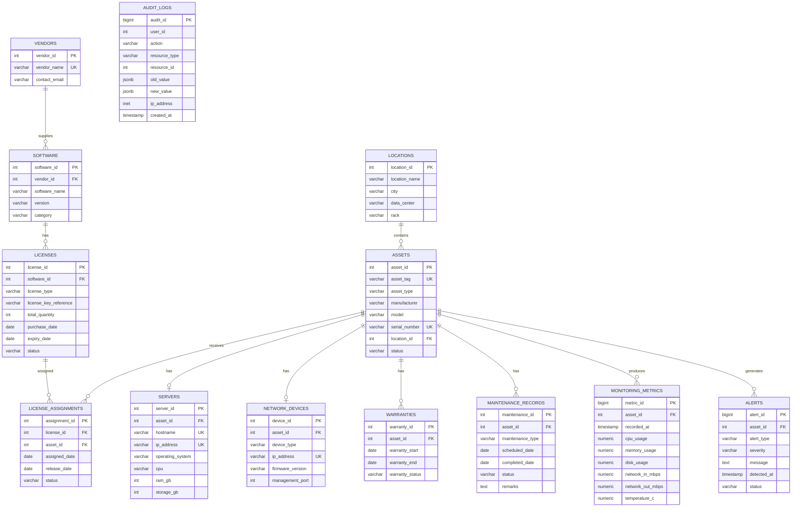

# Cyber Lakshya — ER Diagram Source

```mermaid
erDiagram
    LOCATIONS ||--o{ ASSETS : contains
    ASSETS ||--o| SERVERS : has
    ASSETS ||--o| NETWORK_DEVICES : has
    ASSETS ||--o{ WARRANTIES : has
    ASSETS ||--o{ MAINTENANCE_RECORDS : has
    VENDORS ||--o{ SOFTWARE : supplies
    SOFTWARE ||--o{ LICENSES : has
    LICENSES ||--o{ LICENSE_ASSIGNMENTS : assigned
    ASSETS ||--o{ LICENSE_ASSIGNMENTS : receives
    ASSETS ||--o{ MONITORING_METRICS : produces
    ASSETS ||--o{ ALERTS : generates

    LOCATIONS {
        int location_id PK
        varchar location_name
        varchar city
        varchar data_center
        varchar rack
    }
    ASSETS {
        int asset_id PK
        varchar asset_tag UK
        varchar asset_type
        varchar manufacturer
        varchar model
        varchar serial_number UK
        int location_id FK
        varchar status
    }
    SERVERS {
        int server_id PK
        int asset_id FK
        varchar hostname UK
        varchar ip_address UK
        varchar operating_system
        varchar cpu
        int ram_gb
        int storage_gb
    }
    NETWORK_DEVICES {
        int device_id PK
        int asset_id FK
        varchar device_type
        varchar ip_address UK
        varchar firmware_version
        int management_port
    }
    WARRANTIES {
        int warranty_id PK
        int asset_id FK
        date warranty_start
        date warranty_end
        varchar warranty_status
    }
    MAINTENANCE_RECORDS {
        int maintenance_id PK
        int asset_id FK
        varchar maintenance_type
        date scheduled_date
        date completed_date
        varchar status
        text remarks
    }
    VENDORS {
        int vendor_id PK
        varchar vendor_name UK
        varchar contact_email
    }
    SOFTWARE {
        int software_id PK
        int vendor_id FK
        varchar software_name
        varchar version
        varchar category
    }
    LICENSES {
        int license_id PK
        int software_id FK
        varchar license_type
        varchar license_key_reference
        int total_quantity
        date purchase_date
        date expiry_date
        varchar status
    }
    LICENSE_ASSIGNMENTS {
        int assignment_id PK
        int license_id FK
        int asset_id FK
        date assigned_date
        date release_date
        varchar status
    }
    MONITORING_METRICS {
        bigint metric_id PK
        int asset_id FK
        timestamp recorded_at
        numeric cpu_usage
        numeric memory_usage
        numeric disk_usage
        numeric network_in_mbps
        numeric network_out_mbps
        numeric temperature_c
    }
    ALERTS {
        bigint alert_id PK
        int asset_id FK
        varchar alert_type
        varchar severity
        text message
        timestamp detected_at
        varchar status
    }
    AUDIT_LOGS {
        bigint audit_id PK
        int user_id
        varchar action
        varchar resource_type
        int resource_id
        jsonb old_value
        jsonb new_value
        inet ip_address
        timestamp created_at
    }
```
